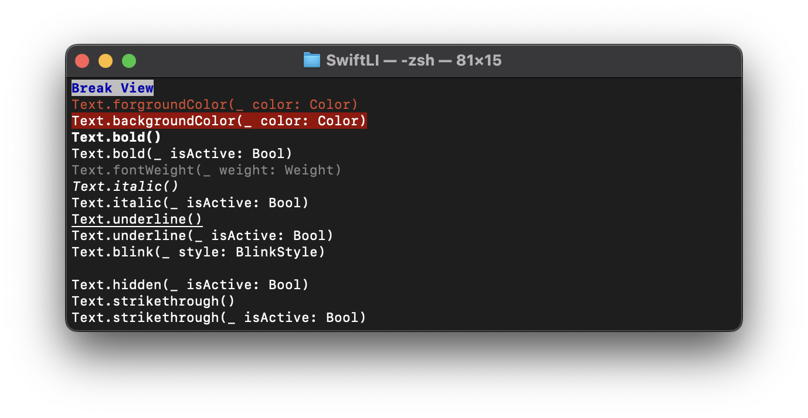

# SwiftLI
SwiftLI is a library aimed at writing command line displays in Swift in a SwiftUI-like manner, and was inspired by SwiftUI and Ignite.  
Just as SwiftUI is a library that makes it easy to build a GUI in Swift, SwiftLI aims to make it easy to build a CLI in Swift.

> [!WARNING]
> SwiftLI is under active development and its API is still evolving.
> Depending on the version you use, this README and the documentation may not
> match the actual behavior. When in doubt, refer to the DocC comments and
> sample commands (`Sources/sclt`) of the version you have checked out.

## Requirement
The following environment is required to use this library.

<p align="center">
    
    
    <a href="https://twitter.com/IroIro1234work">
        
    </a>
</p>

## Demo
The library includes a command line tool that allows you to verify its operation. Please use the following method to check the command line tool along with the source code.
### Using CMake
1. download this project file
2. open a terminal
3. Type the following command
``` sh
cd <Path to this project>
make install
```
### Using Homebrew
1. Type the following command in a terminal
``` sh
brew install kc-2001ms/tap/sclt
```
## Usage

### A first command
Conform an `AsyncParsableCommand` to `InlineCommand` and declare a `body` —
no `run()` is required. The body is rendered inline at the cursor, stays in
the terminal scrollback, and the command exits by itself once there is
nothing left to do:

```swift
import ArgumentParser
import SwiftLI

@main
struct HelloCommand: InlineCommand {
    static let configuration = CommandConfiguration(
        commandName: "hello",
        abstract: "Print a greeting",
        version: "1.0.0"
    )

    var body: some Scene {
        Text("Hello, SwiftLI!")
            .bold()
            .forgroundColor(.cyan)
    }
}
```

`CommandConfiguration` is ArgumentParser's standard way to give the command
its name, abstract, and version (`--help` / `--version` come from it). The
later examples omit it for brevity, but real commands should declare one.

### Reactive state
`@State` and Swift's `Observation` framework (`@Observable`) drive the display.
Start work with the `.task` modifier; every property the body reads is
observation-tracked, so mutations redraw automatically. The session ends on
its own when the work finishes:

```swift
@Observable
final class DownloadModel: @unchecked Sendable {
    var progress = 0.0
}

struct FetchCommand: InlineCommand {
    let model = DownloadModel()

    var body: some Scene {
        ProgressView(min: 0, value: .constant(model.progress), max: 1)
            .task { await download(into: model) }   // 完了 → やることゼロ → 自動終了
    }
}
```

The session stays alive while anything could still change the display:
- a `.task` is running,
- an interactive control is on screen,
- a redraw driver (`TimelineView`, `CLITimer`) is active.

`@Environment(\.dismiss)` and <kbd>Ctrl-C</kbd> end the session immediately at
any point.

### Interactive controls
Controls (`Button`, `TextField`, `Toggle`, `Picker`, `List`, …) join a focus
ring — <kbd>Tab</kbd> moves focus, arrows and <kbd>Space</kbd> edit values,
<kbd>Return</kbd> fires a `Button`'s action or a `TextField`'s `onSubmit`.
Value controls are pure editors; confirmation belongs to a `Button`. A flow
ends by *hiding* its controls in the confirming action:

```swift
struct ConfirmCommand: InlineCommand {
    @State var proceed = false
    @State var answered = false

    var body: some Scene {
        if !answered {
            Toggle("Proceed?", isOn: $proceed)
            Button("OK") { answered = true }   // コントロールが消える → 終了
        } else {
            Text(proceed ? "✔ Proceeding" : "✗ Cancelled")
        }
    }
}
```

### Full-screen commands
Conform to `FullScreenCommand` instead and the same `body` is drawn on the
alternate screen like `vim` or `htop`, restored on exit. Its natural lifetime
is "until the user quits" (<kbd>Ctrl-C</kbd> or `dismiss()`):

```swift
struct DashboardCommand: FullScreenCommand {
    @State var tick = 0
    @Environment(\.dismiss) var dismiss

    var body: some Scene {
        Text("Dashboard — tick \(tick)")
            .task {
                for _ in 0..<140 {
                    try? await Task.sleep(nanoseconds: 80_000_000)
                    tick += 1
                }
                dismiss()
            }
    }
}
```

Commands compose as views: because every command is a `View`, one command's
`body` can embed another. Only the root command decides the rendering mode —
a `FullScreenCommand`-conforming view embedded in an inline session renders
inline.

### Styles
Controls resolve their styles from the environment, so a style applied to a
container flows down to every matching control in the subtree:

```swift
VStack {
    Toggle("Wi-Fi", isOn: $wifi)
    Toggle("Bluetooth", isOn: $bluetooth)
}
.toggleStyle(CheckboxToggleStyle())   // applies to both toggles
```

### Environment values
SwiftLI propagates environment values down the view tree just like SwiftUI. Built-in values such as `\.maxWidth`, `\.colorScheme`, and `\.dismiss` are available, and you can define your own with `EnvironmentKey`:

```swift
private struct VerbosityKey: EnvironmentKey {
    static var defaultValue: Int { 0 }
}

extension EnvironmentValues {
    var verbosity: Int {
        get { self[VerbosityKey.self] }
        set { self[VerbosityKey.self] = newValue }
    }
}

// Inject for a subtree (the nearest injection wins) …
StatusView().environment(\.verbosity, 2)

// … and read it below the injection.
struct StatusView: View {
    @Environment(\.verbosity) private var verbosity
    var body: some View { Text("verbosity: \(verbosity)") }
}
```

`@Observable` model objects can also be injected by their type, with no key declaration — reads are observation-tracked, so mutations re-render automatically:

```swift
RootView().environment(appModel)                      // inject by type

@Environment(AppModel.self) private var model         // read (must be injected)
@Environment(AppModel?.self) private var optional     // read (nil when absent)
```



## Install
Add the following files to the Package.swift file for use. For more information, please visit [swift.org](https://www.swift.org/documentation/package-manager/).
``` swift
    dependencies: [
        // Add this code
        .package(url: "https://github.com/KC-2001MS/SwiftLI.git", from: "0.3.0"),
    ],
```

## Swift-DocC
Swift-DocC is currently being implemented.

[Documentation](https://kc-2001ms.github.io/SwiftLI/documentation/swiftli)

## Contribution
See [CONTRIBUTING.md](https://github.com/KC-2001MS/SwiftLI/blob/main/CONTRIBUTING.md) if you want to make a contribution.

## Licence
[SwiftLI](https://github.com/KC-2001MS/SwiftLI/blob/main/LICENSE)

## Supporting
If you would like to make a donation to this project, please click here. The money you give will be used to improve my programming skills and maintain the application.  
<a href="https://www.buymeacoffee.com/iroiro" target="_blank">
    
</a>  
[Pay by PayPal](https://paypal.me/iroiroWork?country.x=JP&locale.x=ja_JP)

## Author
[Keisuke Chinone](https://github.com/KC-2001MS)
