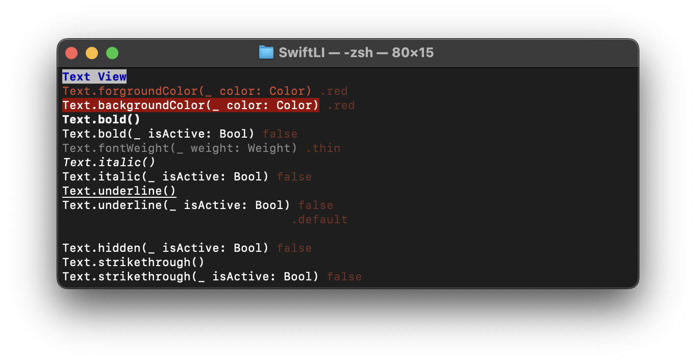

# SwiftLI
SwiftLI is a library aimed at writing command line displays in Swift in a SwiftUI-like manner, and was inspired by SwiftUI and Ignite.  
Just as SwiftUI is a library that makes it easy to build a GUI in Swift, SwiftLI aims to make it easy to build a CLI in Swift.

## Requirement
The following environment is required to use this library.

<p align="center">
    
    
    <a href="https://twitter.com/IroIro1234work">
        
    </a>
</p>

## Demo
This library includes a command line tool that allows you to verify its operation. Please check it out along with the source code for the command line tool.

## Usage
You can easily build a command line CUI by constructing your code as follows
```swift
import ArgumentParser
import SwiftLI

struct TextCommand: ParsableCommand {
    static var configuration = CommandConfiguration(
        commandName: "text",
        abstract: "Display of Text structure",
        discussion: """
        Command to check the display of Text structure
        """,
        version: "0.0.1",
        shouldDisplay: true,
        helpNames: [.long, .short]
    )
    
    mutating func run() {
        let group = Group {
            Text("Break View")
                .background(Color.white)
                .forgroundColor(Color.blue)
                .bold()
                .newLine()
            
            Group {
                Text("Text.forgroundColor(_ color: Color)")
                    .forgroundColor(.red)
                    .newLine()
                
                Text("Text.backgroundColor(_ color: Color)")
                    .background(.red)
                    .newLine()
                
                Text("Text.bold()")
                    .bold()
                    .newLine()
                
                Text("Text.bold(_ isActive: Bool)")
                    .bold(false)
                
                Break(1)
                
                Text("Text.fontWeight(_ weight: Weight)")
                    .fontWeight(.thin)
                    .newLine()
                
                Text("Text.italic()")
                    .italic()
                    .newLine()
                
                Text("Text.italic(_ isActive: Bool)")
                    .italic(false)
                    .newLine()
                
                Text("Text.underline()")
                    .underline()
                    .newLine()
                
                Text("Text.underline(_ isActive: Bool)")
                    .underline(false)
                    .newLine()
                
                Text("Text.blink(_ style: BlinkStyle)")
                    .blink(.default)
                    .newLine()
                
                Text("Text.hidden()")
                    .hidden()
                    .newLine()
                
                Text("Text.hidden(_ isActive: Bool)")
                    .hidden(false)
                    .newLine()
                
                Text("Text.strikethrough()")
                    .strikethrough()
                    .newLine()
                
                Text("Text.strikethrough(_ isActive: Bool)")
                    .strikethrough(false)
                    .newLine()
            }
        }
        
        group.render()
    }
}
```


## Swift-DocC
Swift-DocC is currently being implemented.

[Documentation](https://kc-2001ms.github.io/SwiftLI/documentation/swiftli)

## Contribution
1. Fork it
2. Create your feature branch
3. Commit your changes
4. Push to the branch
5. Create new Pull Request

## Licence
[SwiftLI](https://github.com/KC-2001MS/SwiftLI/blob/main/LICENSE)

## Supporting
If you would like to make a donation to this project, please click here. The money you give will be used to improve my programming skills and maintain the application.  
<a href="https://www.buymeacoffee.com/iroiro" target="_blank">
    
</a>  
[Pay by PayPal](https://paypal.me/iroiroWork?country.x=JP&locale.x=ja_JP)

## Author
[Keisuke Chinone](https://github.com/KC-2001MS)
